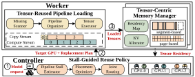

# Tangram

Tangram is a serverless LLM serving system that reduces model-switch latency by
jointly optimizing tensor-granular GPU memory reuse, transition-aware routing,
and pipelined model loading. Its stall-guided cache policy retains the model
prefixes with the greatest exposed-loading benefit, while LayerWeave overlaps
the transfer of missing tensor groups with Prefill execution. Tangram also
integrates ElasticKV for on-demand KV-cache allocation.

This repository contains the Tangram runtime, the modified vLLM/ElasticKV
inference stack, the real-GPU LayerPipe/LayerWeave implementation, and the
tensor-level simulator and evaluation artifacts used to reproduce the paper
results.

[](docs/Tangram-V2/Tangram-2.svg)

---

## System Requirements
- CUDA Version: 12.4
- Python Version: 3.10

NOTE: other versions of CUDA and Python may also work, but we have not tested them.

## Getting Started


- Create envs on Controller Node and Worker Nodes, respectively
````bash
conda create -n sllm-0.6 python=3.10 -y
conda create -n sllm-worker-0.6 python=3.10 -y
````

- Install
````bash
conda activate sllm-0.6
cd Tangram
pip install .

conda activate sllm-worker-0.6
cd Tangram
pip install .
cd sllm_store
./rebuild.sh

cd Tangram/ElasticKV
pip install .
````
Details of installation and errors can be found in [EnvironmentSetup.md](evaluation/EnvironmentSetup.md)

## Performance Benchmarks

The Tangram V2 paper evaluation is documented under
[docs/Tangram-V2](docs/Tangram-V2/). Reproduction commands are organized by
experiment:

- [Overall system comparison](docs/Tangram-V2/experiments/overall.md): Baseline,
  Pipe-only, Reuse-only, Aegaeon, and Tangram.
- [Cache and routing policies](docs/Tangram-V2/experiments/cache-policy.md):
  Bytes-LRU, Bytes-SuffixLRU, Bytes-MCKP, and Joint-MCKP.
- [Memory backends](docs/Tangram-V2/experiments/memory-backend.md): Segment,
  Tensor-page, and Compact-page, including page-size and cache-pressure sweeps.
- [System overhead and PSE accuracy](docs/Tangram-V2/experiments/overhead.md):
  CUDA readiness hooks/events and predicted-versus-measured exposed loading
  stall.

The corresponding summarized results and figure sources are indexed in
[docs/Tangram-V2/results.md](docs/Tangram-V2/results.md). 

## Detailed Instructions
A detailed instruction for creating CRIU checkpoints and restoring models can be found in [quick_start.md](evaluation/quick_start.md)

## Acknowledgements
This project is a fork of [ServerlessLLM](https://github.com/ServerlessLLM/ServerlessLLM), and I would like to thank the original author(s) for their amazing work. You can also cite the original paper: ServerlessLLM: Low-Latency Serverless Inference for Large Language Models.
