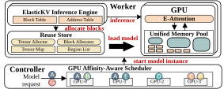

# Tangram

A serverless LLM framework that accelerates model loading through GPU memory reuse and affinity. 
This repo contains the source code of Tangram and ElasticKV (a Inference Engine that supports on-demand KV cache allocation) and evaluation scripts for the paper: **Tangram: Accelerating Serverless LLM Loading through GPU Memory Reuse and Affinity**

<p align="center">
  
</p>

---

## System Requirements
- CUDA Version: 12.4
- Python Version: 3.10

NOTE: other versions of CUDA and Python may also work, but we have not tested them.

## Getting Started


- Create envs on Controller Node and Worker Nodes, respectively
````bash
conda create -n sllm-0.6 python=3.10 -y
conda create -n sllm-worker-0.6 python=3.10 -y
````

- Install
````bash
conda activate sllm-0.6
cd Tangram
pip install .

conda activate sllm-worker-0.6
cd Tangram
pip install .
cd sllm_store
./rebuild.sh

cd Tangram/ElasticKV
pip install .
````
Details of installation and errors can be found in [EnvironmentSetup.md](evaluation/EnvironmentSetup.md)

## Performance Benchmarks


We provide instructions and scripts for each evaluation, including:
- [TTFT](evaluation/Overall-TTFT.md)
- [Decode Throughput](evaluation/Overall-Decode.md)
- [Breakdown](evaluation/Breakdown.md)
- [Sensitivity](evaluation/Sensitivity.md)
- [Multi-GPU](evaluation/Scalability.md)

## Detailed Instructions
A detailed instruction for creating CRIU checkpoints and restoring models can be found in [quick_start.md](evaluation/quick_start.md)

## Acknowledgements
This project is a fork of [ServerlessLLM](https://github.com/ServerlessLLM/ServerlessLLM), and I would like to thank the original author(s) for their amazing work. You can also cite the original paper: ServerlessLLM: Low-Latency Serverless Inference for Large Language Models.
